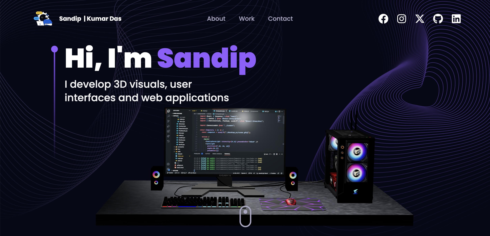

    
    

      
      
      
    

    <h1>🌟 3D Developer Portfolio</h1>
  

  

  <h2>🖥️ Overview</h2>
  

    This is my personal portfolio website designed to showcase my projects, skills, and expertise as a software developer. Built using modern technologies, this 3D interactive website demonstrates my proficiency in front-end development and creative design.
  

  

    🚀 <strong>Live Demo</strong>: <a href="https://portfolio-18md.onrender.com/" target="_blank">View Portfolio on Render</a>
  

  

  <h2>📋 Table of Contents</h2>
  <ol>
    <li><a href="#features">✨ Features</a></li>
    <li><a href="#tech-stack">⚙️ Tech Stack</a></li>
    <li><a href="#quick-start">🤸 Quick Start</a></li>
    <li><a href="#deployment">🚀 Deployment</a></li>
    <li><a href="#contribution">🤝 Contribution</a></li>
    <li><a href="#license">📜 License</a></li>
    <li><a href="#acknowledgments">💖 Acknowledgments</a></li>
  </ol>

  

  <h2 id="features">✨ Features</h2>
  <ul>
    <li>🎨 <strong>Interactive 3D Graphics</strong>: Stunning visuals built with <code>three.js</code> and <code>@react-three/fiber</code>.</li>
    <li>🌀 <strong>Smooth Animations</strong>: Powered by <code>framer-motion</code> for engaging transitions.</li>
    <li>📱 <strong>Responsive Design</strong>: Tailored to look great on any device.</li>
    <li>📜 <strong>Timeline View</strong>: Showcase of experience and projects using <code>react-vertical-timeline-component</code>.</li>
    <li>📬 <strong>Dynamic Contact Form</strong>: Integrated with <code>@emailjs/browser</code> for seamless communication.</li>
    <li>🔗 <strong>Routing</strong>: Smooth navigation experience with <code>react-router-dom</code>.</li>
    <li>🌌 <strong>3D Stars Background</strong>: Adds depth to the website using random 3D star generation.</li>
    <li>💡 <strong>Customizable Components</strong>: Reusable components for scalability and flexibility.</li>
  </ul>

  

  <h2 id="tech-stack">⚙️ Tech Stack</h2>
  <ul>
    <li>⚛️ <strong>React.js</strong></li>
    <li>🖼️ <strong>Three.js</strong></li>
    <li>🧱 <strong>@react-three/fiber</strong></li>
    <li>🚀 <strong>@react-three/drei</strong></li>
    <li>🎨 <strong>Tailwind CSS</strong></li>
    <li>🎥 <strong>Framer Motion</strong></li>
    <li>📬 <strong>EmailJS</strong></li>
    <li>⚡ <strong>Vite</strong></li>
  </ul>

  

  <h2 id="quick-start">🤸 Quick Start</h2>
  <h3>📋 Prerequisites</h3>
  
Ensure you have Node.js, npm, and Git installed on your system.

  <h3>📥 Installation</h3>
  <ol>
    <li>Clone the repository:
      <pre><code>git clone <repository-url>
cd <project-directory></code></pre>
    </li>
    <li>Install dependencies:
      <pre><code>npm install --legacy-peer-deps</code></pre>
    </li>
    <li>Create a <code>.env</code> file with the following:
      <pre><code>
REACT_APP_EMAILJS_USERID=your_emailjs_user_id
REACT_APP_EMAILJS_TEMPLATEID=your_emailjs_template_id
REACT_APP_EMAILJS_RECEIVERID=your_emailjs_receiver_id
      </code></pre>
      Replace placeholders with your actual EmailJS credentials.
    </li>
    <li>Run the development server:
      <pre><code>npm run dev</code></pre>
    </li>
  </ol>

  <h3>🏗️ Build</h3>
  
To build the project for production:

  <pre><code>npm install --legacy-peer-deps && npm run build</code></pre>

  

  <h2 id="deployment">🚀 Deployment</h2>
  
The portfolio is deployed on Render. For redeployment, push changes to the repository linked with Render, and it will rebuild automatically.

  

  <h2>🌍 Website Preview</h2>
  
Here’s a preview of my portfolio website:

  

  

  <h2 id="contribution">🤝 Contribution</h2>
  
This is a personal project, so contributions are not currently open. However, feedback and suggestions are always welcome! Reach out through the contact form on the website. 💬

  

  <h2 id="license">📜 License</h2>
  
🛡️ Licensed under the <strong>MIT License</strong>. See the LICENSE file for details.

  

  <h2 id="acknowledgments">💖 Acknowledgments</h2>
  
Special thanks to the <strong>open-source community</strong> for the incredible tools and libraries used in this project. 🌐🙌

